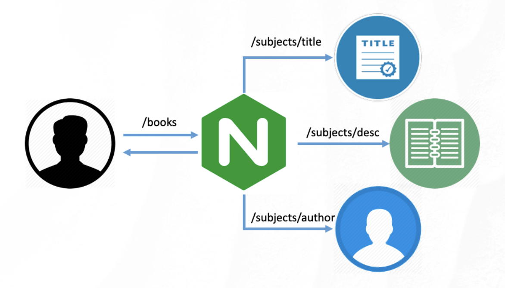

### Batching Requests to Upstream API

The official use case reference: https://www.nginx.com/blog/batching-api-requests-nginx-plus-javascript-module/

This usecase shows using NJS to batching APIs to upstreams, and combining responses to send to the client.

Data can be retrieved in different APIs:

```
    /subjects/[author,description,pages,price,publish,title].json
```

When access the API `/`, NGINX NJS can help us to combine the data together to json format.



```
$ curl -X GET http://localhost:8097

{
    "strategy": {
        "author": "山梨广一",
        "description": "战略构建的6个基本步骤",
        "pages": 228,
        "price": 52,
        "publish": "2014-02",
        "title": "简明战略"
    },
    "diff_workforce": {
        "author": [
            "布莱恩",
            "马克",
            "查理德"
        ],
        "description": "如何让人才转化为战略影响力",
        "pages": 245,
        "price": 59.9,
        "publish": "2016-03",
        "title": "重新定义人才"
    },
    "survial_guide": {
        "author": "埃德加.沙因",
        "description": "变革时代的企业文化之道",
        "pages": 243,
        "price": 59.9,
        "publish": "2017-01",
        "title": "企业文化生存与变革指南"
    },
    "performance": {
        "author": "约翰 惠特默",
        "description": "The principles and practice of coaching and leadership.",
        "pages": 259,
        "price": 79,
        "publish": "2019-12",
        "title": "高绩效教练"
    }
}
```
